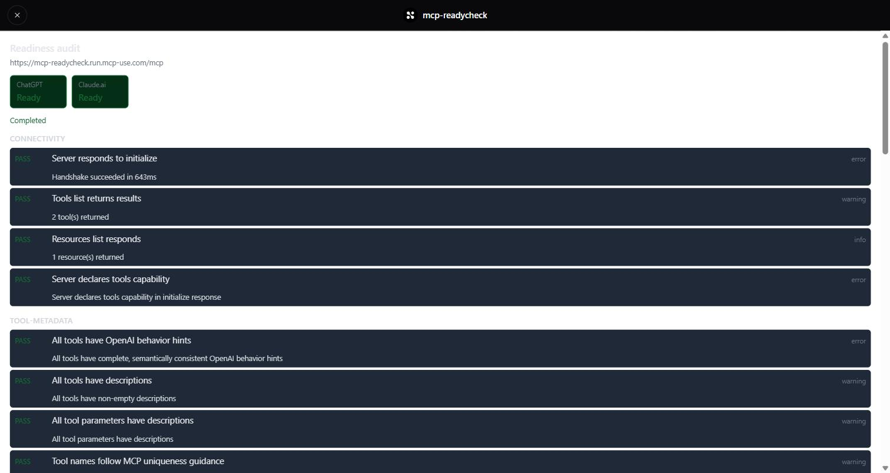

# mcp-readycheck

[](https://github.com/quanticsoul4772/mcp-readycheck/actions/workflows/ci.yml)

An MCP App that runs Manufact's publishing checks against its own
deployed URL and renders the report by category.

Live endpoint: `https://mcp-readycheck.run.mcp-use.com/mcp`

## Background

Publishing an MCP app to ChatGPT or Claude fails on things that do not
surface in local testing: CSP allowlists, tool annotations, resource
metadata. Manufact's publishing checks report those before submission.
This app runs those checks against its own deployment and shows the
result.

## Install

```sh
git clone https://github.com/quanticsoul4772/mcp-readycheck
cd mcp-readycheck
npm install
```

Requires Node 22.22.2 or later.

## Usage

```sh
npm run dev
```

Serves `/mcp` on port 3000. Inspector at `http://localhost:3000/mcp/inspector`.

Set `MANUFACT_API_KEY` in the environment. Without it every tool call
returns an error and sends no request.



## API

### `start_audit`

Starts a publishing-check audit for a server.

| input | type | |
|---|---|---|
| `serverId` | string | Manufact server id |

Returns `{ auditId, status }`. Renders the `audit-report` view.

### `get_audit`

Reads an audit's current state.

| input | type | |
|---|---|---|
| `serverId` | string | Manufact server id |
| `auditId` | string | id returned by `start_audit` |

Returns `{ auditId, status, isReadyForChatgpt, isReadyForClaudeai,
targetUrl, errorMessage, checks[] }`. App-only; called by the view.

## Status

Latest audit of this deployment: `6262a04a` — 32 checks, 31 passing,
`isReadyForChatgpt` true, `isReadyForClaudeai` true.

The one failing check, `tool-resource-metadata-complete`, requires a
widget-description field that mcp-use 2.3.3 does not expose. Manufact's own
autofix agent read the code and reached the same conclusion; it does not show
autofix repairing a defect, which would have meant breaking the deployment to
create one. Details in
[docs/PROCESS.md](docs/PROCESS.md#the-one-red-check).

## Deploy

```sh
npx -y mcp-use@latest deploy -y
```

GitHub-connected; push to `main` deploys.

## Test

```sh
npm run test:check   # discovery matches the index and CI
npm run test:pure    # no network, no key — what CI runs
npm run test:live    # POSTs real audits; needs MANUFACT_API_KEY
```

## Documentation

- [docs/demo/README.md](docs/demo/README.md) — staged-failure demo: break,
  red audit, revert, green audit
- [docs/demo/autofix-probe.md](docs/demo/autofix-probe.md) — Manufact
  autofix run against the failing check
- [docs/PROCESS.md](docs/PROCESS.md) — process record, pull-request
  census, known residuals
- [AGENTS.md](AGENTS.md) — conventions and mistake log
